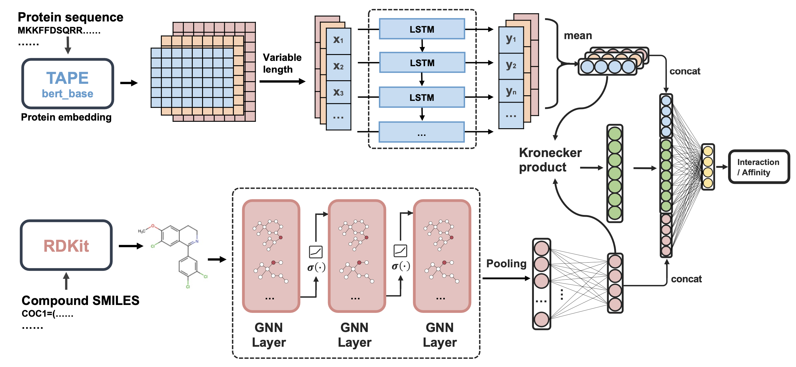

# PMF-CPI：Assessing drug selectivity with a pretrained multi-functional model for compound-protein interactions

## Brief introduction

Here we present a sequence-only and pretrained multi-functional model for compound-protein interaction prediction (PMF-CPI) and fine-tune it to assess drug selectivity.  PMF-CPI can accurately predict different drug affinities or opposite interactions toward similar targets, recognizing selective drugs for precise therapeutics.  The code is implementation on PyTorch. Our training data and pre-trained model can be downloaded from xxx.xxx.

In this repository, we provide datasets for different tasks of classification and regression. The overview of our CPI prediction  is as follows:



The detail of our model are described in our paper.

## Usage

### Requirements

* PyTorch 1.7.1

* torch-geometric

* RDKit

We utlized three embedding methods as follows:

* TAPE: https://github.com/li-ziang/tape

* ESM-2:https://github.com/facebookresearch/esm

* Bio2Vec:https://github.com/kyu999/biovec

### Dataset structure

Please organize each dataset as the following structure:

```
datasets/
└── dataset1/
    ├── ind_test/
    |   └── affinity.tsv
        └── proteins.txt
        └── compounds.txt
    └── train/
    |   └── affinity.tsv
        └── proteins.txt
        └── compounds.txt
    └── proteins.txt	# all relevent proteins 
...
```

### Training

For different tasks such as regression and classification, the model’s training parameters can be set in `train.py`. Prior to training, it is necessary to generate the required embedding files through data_process.py. The embedding files will be saved at `datasets/dataset_sample/tape`. 

By utilizing the embeddings from these large-scale protein language models, our model can converge quickly with minimal computational resources.

### Test

Before starting the testing by `test.py`, it is important to ensure that the `datasets/dataset_sample/ind_test` folder contains the necessary files for testing, and that the corresponding embedding files have been generated through data_process.py. Alternatively, all required protein sequences can be placed in `datasets/dataset_sample/proteins.txt` and saved as a dictionary. The embedding files will be stored under `datasets/dataset_sample/embedding_method ` folder.

### Fine-tune

Based on the model training above, we can fine-tune on a new dataset of selective drugs using the code provided in `fintune.py`. Fine-tuning allows for relatively accurate predictions on most unknown data with the assistance of only a small amount of data.


## TODO

Note that the model has set a maximum sequence length, longer sequences may require a larger model to be trained without truncation, even this does not significantly affect the model’s accuracy. It is also important in future studies to effectively process sequence information into fixed sizes. Additionally, the model attempted to fuse protein and compound features, but further features and integration strategies should be considered.


